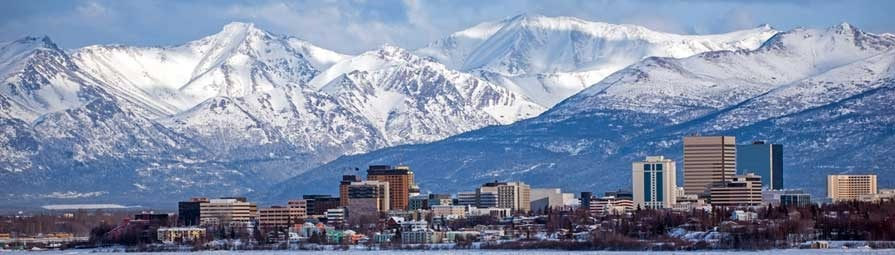

# AlaskScraper

I love Alaska.  I REALLY love Alaska.  I'm fascinated by Alaska.  I've gone to Alaska the week of the Summer Solstice each of the last 3 years.  But for the other 51 weeks out of the year, I still want to know what's going on in Alaska.  That's why I developed the AlaskScraper.  AlaskScraper is an Alaska news scraper powered by the Alaska News section of the Alaska Daily News Miner aka "the Voice of Interior Alaksa."  AlaskScraper instantly gives me all of the top headlines in Alaska News right at my finger tips, with the ability to comment on each article.

Give it a shot to learn about the Last Frontier!
https://alaskscraper.herokuapp.com/
