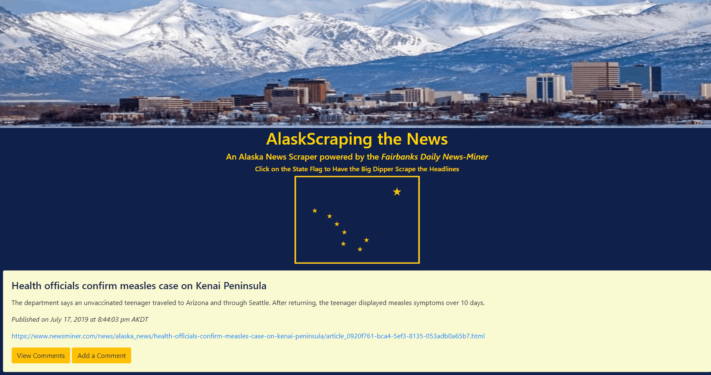
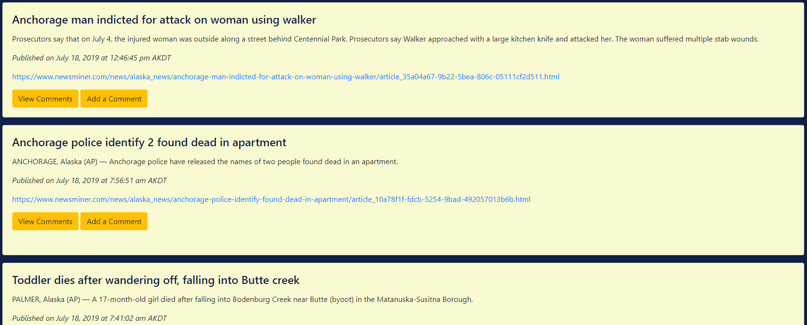

# AlaskScraper

I love Alaska.  I REALLY love Alaska.  I'm fascinated by Alaska.  I've gone to Alaska the week of the Summer Solstice each of the last 3 years.  But during the other 51 weeks of the year, I still want to know what's going on in Alaska!  That's why I developed the AlaskScraper.  AlaskScraper is an Alaska news scraper powered by the Alaska News section of the Fairbanks Daily News Miner aka "the Voice of Interior Alaksa."  AlaskScraper instantly gives me all of the top headlines in Alaska News right at my finger tips, with the ability to comment on each article.

## How It Works

### Scraping the News

Click on the Alaska state flag in the middle of the page to scrape for new headlines.  AlaskScraper is programmed to sort the database response and display the most recently published headlines at the top of the list, so you will see the newest news first.

### Managing Comments

Click on **View Comments** to see any existing comments related to the specific article.  Old comments can be deleted by clicking the **Delete Comment** button below comment.  New comments can be added by clicking the **Add Comment** button.  Once you are finished managing comments, click the **Close Comments** button to hide the Comments section and get back to the news.

## Take the Dip!

Give it a scrape to learn about what's happening on the Last Frontier!

https://alaskscraper.herokuapp.com/
